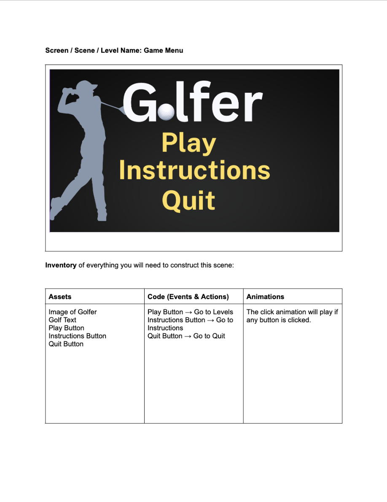

# **Assessment Game Plan**

## **Identifying and Defining**

### **Identifying the Need**

I am creating a golf like game where the user hits the ball with a certain amount of power. The more you drag back, the more power the golf ball gets. As the user, you will have to complete levels with the least amount of swings possible. This game would require a variety of skills that include focus, hand-eye coordination and problem-solving. It is vital that children gain skills such as focus, hand-eye coodination and problem-solving and this game provides these skills while making it interactive and entertaining which is an important part of teaching skills to children. I will utilise the rolling ball tutorial to get a base of creating the game then use other tutorials to get the ball velocity or mouse drag movement.

### **Requirements Online**

**Inputs**

When the user pulls back the mouse the amount its pulled back should correspond to the amount of velocity that the ball has. When the user scrolls on the scrollwheel, the camera should scroll out.When the user holds right click and moves the mouse, it should be a sort aiming tool, panning around.

**Processing**

When aiming,  the user should not aim when the ball is rolling or when it is already in the hole. When the ball is moving and it collides with a wall, it should be able to bounce off the wall with respective velocity. 

**Outputs**

The number of turns spent and par should both be put on the topside of the screen.After completing the level, a number of stars should be allocated with the par being 2 stars, under par being 3 stars and above the par being 1 star. After the golf ball is put into the golf hole, there should be a victory sound. After striking the ball, a ding sound of some sort should be made.

**Transmission**

There will be no multiplayer options in the game.

**Storage**

The data of the game should be able to be saved locally on the computer of the one playing the game.

### **Functional Requirements**

**User Interactions**

Using WASD will turn and aim your camera in the corresponding direction. If the user clicks space, it will make the ball temperarily go up and down, sort of like jump function. By dragging the mouse back, it will make the ball go forwards. '

**Core Gameplay or Simulation Mechanics**
 
There are many mechanics incorperated into my game such as a pull back mechanic where you pull back your mouse the amount you pull back translates to the velocity that the ball has. It also has a wall bounce mechanic and when the ball bounces off the wall, it should lose velocity and bounce back accordingly. 

**Scoring and Feedback**

There is a scoring system with the par being a certain number. The amount of swings would corrolate with the amount of stars with on par being 2 stars, over par being 1 star and under par being 3 stars. This should be able to be saved.

**Level Progression or Simulation Stages**

There is a level system and after completing one level, you will move on to the next level. After getting the ball into the hole, there will be an option whether to redo the level to get more stars or to move onto the next level.

**Saving and Data Loading**

Data will be saved locally on the user's device.

### **Non-Functional Requirements**

**Performance Requirements**

The game should be smooth with all textures and parts loading in quickly. Moving onto the next stage or repeating a stage should be almost instant. The game should load within a couple seconds and respond to inputs instantly.

**Usability Requirements**

The game will have a play button and an instructions button after loading in. After clicking play, the levels should come up. If the user clicks instructions, a step-by-step guide should come up. This game should be fairly easy to navigate.

**Scalability Requirements**

The game is extremely scalable as it would be easy to add new stages or levels as the scripts and mechanics should be virtually the same.

### **Consideration of Social and Ethical Issues**

Equity: equity is all about fairness, giving everyone an equal chance but it could also to do with the value of shares, issued by a company
Accessibility: accessibility is all about whether everyone has the ability to play the game or whether it can be used by everyone.

**Accessability**

Accessability is an important part of video creation and by making it so that games are accessible to everyone, it makes it so that the game has a wider reach. My game would allow for a large number of people to be able to play it as it realistically only requires one hand to play and doesn't require wifi

**Privacy and Data Protection**

All games take personal data of the user to enhance the gameplay of users and my game, in order to make it better, takes the level data of the user and saves it so that when the player restarts the application, it saves. 

**Fairness and Representation**

Games are often played by young individuals and have a strong influence on their thoughts, making it important to display the game without any negative representation. My game incorporates a non-competitive game with no negative representation. My game will be fair and shots with the same shot type will be resulted with the same result.

**Mental and Emotional Well-Being**

Mental and emotional well-being are vulnerable topics and are best to avoid when making a game. Overly competitive games may foster emotional and mental stress. My game doesn't incorporate anythibg to do with mental and emotional well-being with no competitive elements.

**Cultural Sensativities**

Cultural sensativities will be avoided when creating the game as it can be seen as valuing one culture over another. Globally, there are people with diverse backgrounds and by being mindful of different cultures, it makes others feel less alienated. With that being said, my game will avoid including anything that may be seen as culturally offensive.

## **Researching and Implementing**

### **PMI Table**

| **Existing Game** | **Plus** | **Minus** | **Implication** |
| ---- | ---- | ---- | ---- |
|  **Golf Battle** | The game is extremely similar to what I am creating, except golf battle is multiplayer while mine relies more on levels and completion. It is extremely fast paced and is fun to play with friends. It utilises the power control, precision and strategic ideas used within my game. | Although it is multiplayer, it is too fast paced and being multiplayer, would require wifi or an internet connection to run. It may also be difficult to begin playing with how fast paced the game is. | I have taken some aspects and features from this game such as the aiming feature, power control and the strategy used within the game. It will be a less competitive version, making it more user-friendly. |
|  **Angry Birds** | Angry birds is a game with a similar concept except being 2D, throwing birds into buildings. It utilises a similar pull-back for power feature and strategy due to the lining up to measure the correct trajectory to throw the bird. | Although angry birds requires precision and aiming, it focuses less on direct precision and more on aiming at large targets to knock down buildings, making it different to a golf game which requires both in order to win. | In order to make the game more interesting, the game will take the precision from angry birds and the power feature.
|  **Mario Golf** | Mario golf is a golf type game using the characters from Mario and it, similar to golf battle has precision and power features but the best thing about mario golf is how easy the game is to play and understand. It is single and multiplayer, making it more accessible. | Mario golf may also be difficult to understand due to the different types of shots. This would make it so that it would have a steep learning curve which can be both good or bad but in a game with levels, it would make it difficult to progress. | Mario golf is a good game with a simple concept and I would take, similar to all the games on the list, the precision and power features however, making the game easy to understand and play is also an important feature to possess.

### **Pseudocode and Flow Chart**

**User Interactions**

BEGIN UserInteraction  
&nbsp;&nbsp;WHILE "Scouting"  
&nbsp;&nbsp;&nbsp;&nbsp; IF "W Pressed" THEN  
&nbsp;&nbsp;&nbsp;&nbsp;&nbsp;&nbsp;&nbsp;&nbsp;  DISPLAY "Move Camera Upwards"  
&nbsp;&nbsp;&nbsp;&nbsp; ELSE IF "A Pressed" THEN  
&nbsp;&nbsp;&nbsp;&nbsp;&nbsp;&nbsp;&nbsp;&nbsp;  DISPLAY "Move Camera Leftwards"  
&nbsp;&nbsp;&nbsp;&nbsp; ELSE IF "S Pressed" THEN  
&nbsp;&nbsp;&nbsp;&nbsp;&nbsp;&nbsp;&nbsp;&nbsp;  DISPLAY "Move Camera Downwards"  
&nbsp;&nbsp;&nbsp;&nbsp; ELSE IF "D Pressed" THEN  
&nbsp;&nbsp;&nbsp;&nbsp;&nbsp;&nbsp;&nbsp;&nbsp;  DISPLAY "Move Camera Rightwards"  
&nbsp;&nbsp;&nbsp;&nbsp; END IF  
&nbsp;&nbsp;END WHILE  
&nbsp;&nbsp;WHILE "Aiming"  
&nbsp;&nbsp;&nbsp;&nbsp; INPUT PulledBackAmount  
&nbsp;&nbsp;&nbsp;&nbsp; DISPLAY DistanceTravelled  
&nbsp;&nbsp;END WHILE  

&nbsp;&nbsp;WHILE "Game Start"  
&nbsp;&nbsp;&nbsp;&nbsp; IF "Space Pressed" THEN  
&nbsp;&nbsp;&nbsp;&nbsp;&nbsp;&nbsp;&nbsp;&nbsp;  DISPLAY "Jump"  
&nbsp;&nbsp;&nbsp;&nbsp; END IF  
&nbsp;&nbsp;END WHILE  
END UserInteraction

**Stages**

FUNCTION Main   
&nbsp; INPUT Swings  
&nbsp; OUTPUT Par   

&nbsp; LOOP WHILE "Ball not in hole"   
&nbsp; &nbsp; IF Swings < Par THEN   
&nbsp; &nbsp; &nbsp; OUTPUT "3 Stars"   
&nbsp; &nbsp; ELSE IF Swings = Par THEN  
&nbsp; &nbsp; &nbsp; OUTPUT "2 Stars"  
&nbsp; &nbsp; ELSE  
&nbsp; &nbsp; &nbsp; OUTPUT "1 Star"   
&nbsp; &nbsp; END IF  
&nbsp; &nbsp; OUTPUT "Sound Effect"  
&nbsp; END LOOP  

&nbsp; INPUT UserOption  
&nbsp; OUTPUT "Home"  
&nbsp; OUTPUT "Retry"  
&nbsp; OUTPUT "Next Stage"  

&nbsp; LOOP WHILE UserOption  
&nbsp; &nbsp; IF UserOption = Home THEN  
&nbsp; &nbsp; &nbsp; OUTPUT "Splash Screen"  
&nbsp; &nbsp; ELSE IF UserOption = Retry THEN  
&nbsp; &nbsp; &nbsp; OUTPUT "Go back to same level"  
&nbsp; &nbsp; ELSE IF UserOption = Next Stage THEN  
&nbsp; &nbsp; &nbsp; OUTPUT "Go onto the next stage"  
&nbsp; &nbsp; ELSE  
&nbsp; &nbsp; &nbsp; OUTPUT "Please choose an option"  
&nbsp; &nbsp; END IF  
&nbsp; END LOOP  
END FUNCTION  

## **Gantt Chart**

## **Simulation Storyboard**

### **Game Menu**

### **Level Selection**

### **Level 1**

### **Level Completion**

## **Gameplay Storyboard**

